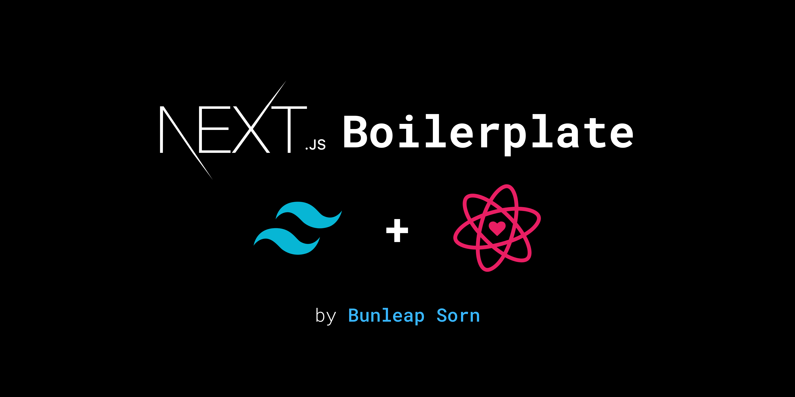
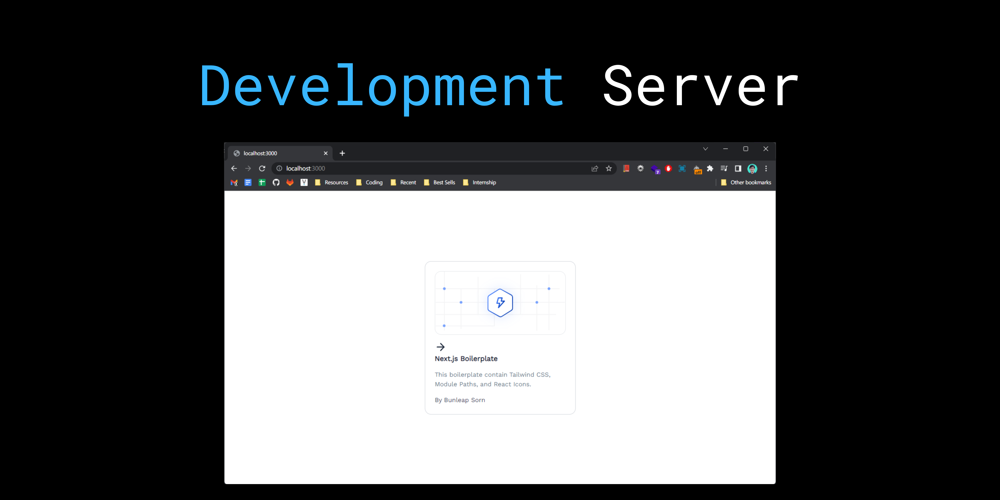
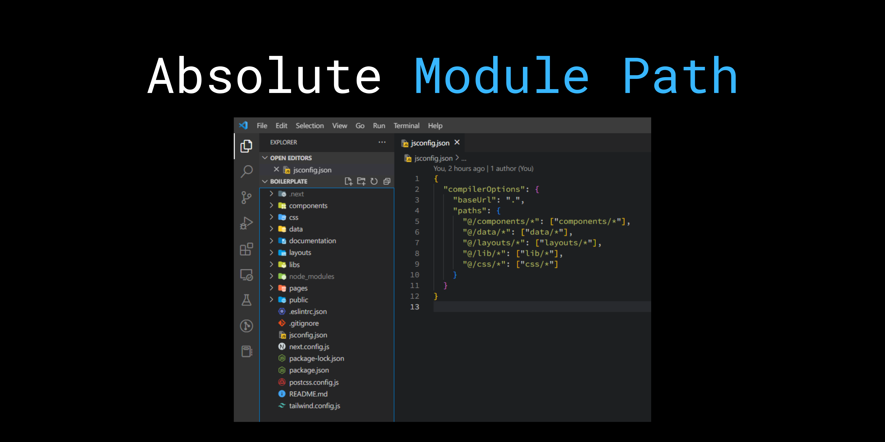
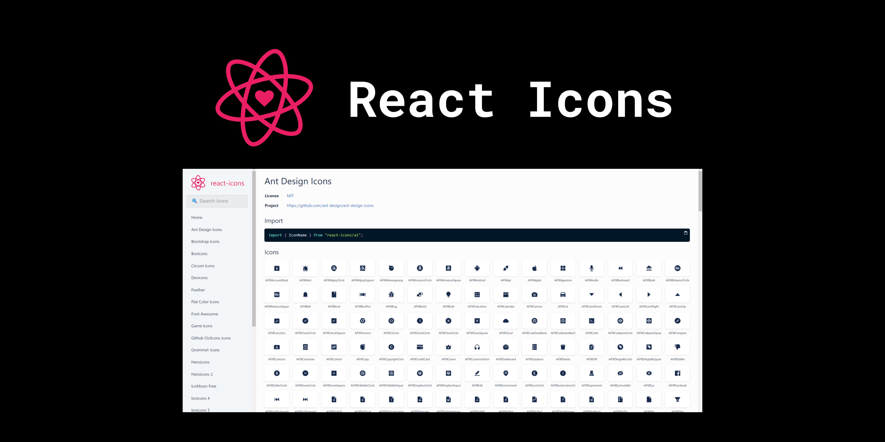

## Basic Installation

Run the following command on your local environment:

```bash
git clone --depth=1 https://github.com/bunleaps/nextjs-boilerplate.git [your project name]
cd [your project name]
npm install
```

Then, you can run locally in development mode with live reload with the command below.



## Development server

```bash
npm run dev
# or
yarn dev
```

Open [http://localhost:3000](http://localhost:3000) with your browser to see the result. You can start editing the page by modifying `pages/index.js`. The page auto-updates as you edit the file.

## API Routes

[API routes](https://nextjs.org/docs/api-routes/introduction) can be accessed on [http://localhost:3000/api/hello](http://localhost:3000/api/hello). This endpoint can be edited in `pages/api/hello.js`. The `pages/api` directory is mapped to `/api/*`. Files in this directory are treated as [API routes](https://nextjs.org/docs/api-routes/introduction) instead of React pages.

## Modular Absolute Path

You can modify absolute path by editing `jsconfig.json`. The path will updates when you saved your changes.



## Static Images

For static images can be found inside the `public/static/images` folder and can be used with `<Image />` from `next/image`.

```jsx
<Image src="/static/images/ux-fast-light.svg" width={341} height={164} />
```

## React Icons

You can use a lot of icons prvided by React Icons. Check out the [React Icons](https://react-icons.github.io/react-icons) website, import and use it.


